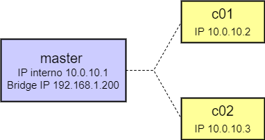

# Sistemas Distribuídos - Cluster de HPC em Vagrant e Virtualbox


Projeto criado com o objetivo de apresentar de forma prática um exemplo de um cluster de computação de alto desempenho. </br>
Diretórios:</br>
&nbsp;&nbsp; <b>master</b> - Scripts de configuração do master node - 512 MB de memória e 1 CPU </br>
&nbsp;&nbsp; <b>c01</b> - Scripts de configuração dos compute node - 512 MB de memória e 1 CPU </br>

Todo projeto foi criado em Ubuntu 20.04 LTS </br>
Após instalar o Ubuntu faça a instalação do Vagrant, wget, libvirt e inicie os serviços:

```
sudo apt-get update
sudo apt-get -y install vagrant libvirt-daemon-system wget
sudo systemctl restart libvirtd
sudo systemctl enable libvirtd
```

<h3> Instale o Virtualbox 6.1.26 </h3>

```
wget https://download.virtualbox.org/virtualbox/6.1.26/virtualbox-6.1_6.1.26-145957~Ubuntu~bionic_amd64.deb
sudo apt-get -y install virtualbox-qt
```

<h3> Para rodar, entre no diretório raíz do projeto e execute </h3>

```
vagrant up
```




<h3> Referências </h3> 
Vagrant 101 - Utilizando Infraestrutura como Código para estudo e desenvolvimento. </br>
https://caiodelgado.dev/vagrant-101/
